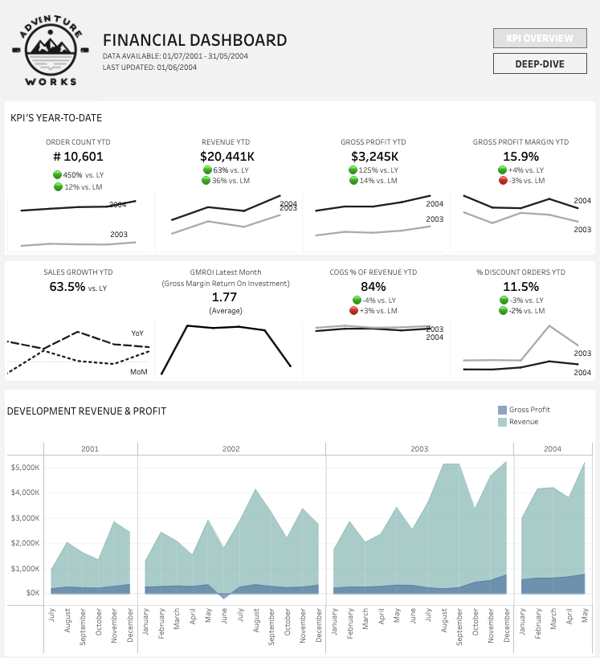

# Project: Building a Sales Dashboard in Tableau

--------------------------------------------
## Project Objective

This project had two objectives. First objective was to build a dashboard in Tableau for the financial department of the AdventureWorks company. The second objective was to use this dashboard as a basis for a presentation presenting insights from the dashboard towards 
a) the executive leadership team of the company and 
b) the finance team

The dashboard and presentation should give an overview and insights into the company's financial performance, health and operational efficiencies. 

**Tools used**
SQL in BigQuery, Tableau, Google Slides

## Project Content

**EXPLORATORY ANALYSIS & DATA CLEANING - BIGQUERY.SQL** - SQL file containing the exploratory analysis and data cleaning/ preparation steps taken in BigQuery to retrieve the required data

[**TABLEAU PUBLIC DASHBOARD**](https://public.tableau.com/views/FinancialAnalysisV2/Dashboard1?:language=en-US&:sid=&:redirect=auth&:display_count=n&:origin=viz_share_link) - Final Tableau dashboard

[**INSIGHTS PRESENTATION**](https://docs.google.com/presentation/d/18FN3XaHby19mkVpWrPZaF04EUt6F7t2chOSQNJPHR7Q/edit?usp=sharing) - Final presentation deck
Executive leadership presentation: slide 1 - 7
Finance team presentation: slide 8 - 16

## Data & Context

**Data Source:** [AdventureWorks company dataset](https://learn.microsoft.com/en-us/sql/samples/adventureworks-install-configure?view=sql-server-ver16&tabs=ssms)

## Output

Tableau Dashboard

